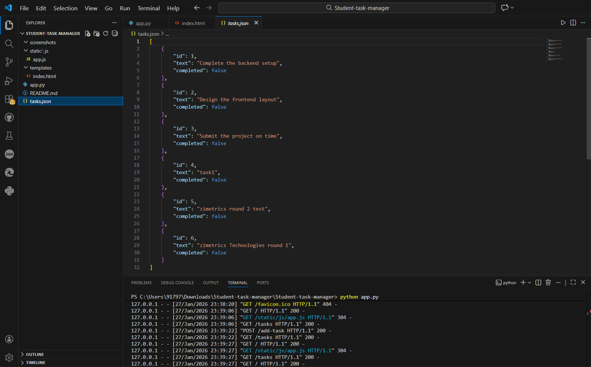
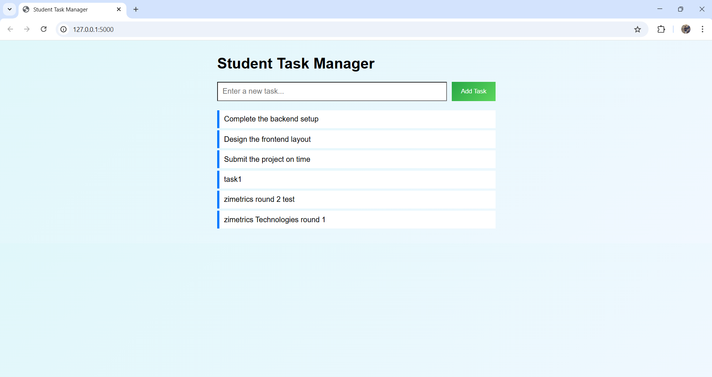

# Student Task Manager

### 1. Project Title & Goal

**Student Task Manager** is a lightweight Single Page Application (SPA) that allows students to add and view daily tasks without page reloads, persisting data locally in a JSON file using a Python Flask backend.

---

### 2. Setup Instructions

**Prerequisites:** You need Python installed on your system.

**Step 1: Install Dependencies**
Open your terminal in the project folder and run:

```bash
pip install flask

```

**Step 2: Run the Application**
Start the backend server:

```bash
python app.py

```

**Step 3: Access the App**
Open your web browser and go to:

```
http://127.0.0.1:5000/

```

---

### 3. The Logic (How I Thought)

**Why this architecture?**
I chose **Python Flask** for the backend because it is minimal and easy to set up for a small API. For the frontend, I used **Vanilla JavaScript** instead of a framework like React because the requirements asked for a simple, lightweight solution. Using a local **JSON file** (`tasks.json`) instead of a database (SQL) keeps the project portable—you don't need to install any database servers to run my code.

**How Frontend and Backend Communicate**
I treated the Frontend and Backend as two separate entities that talk via HTTP:

1. **Adding a Task:** When the user clicks "Add", JavaScript prevents the default form submit. Instead, it uses `fetch()` to send a `POST` request with the task text to `/add-task`.
2. **Saving Data:** Flask receives this, opens `tasks.json`, appends the new dictionary, and saves the file.
3. **Updating UI:** The frontend waits for a "Success" 200 OK response from Flask, then clears the input box and re-fetches the list to update the DOM dynamically.

**Hardest Bug Faced & Fix**
The hardest bug I encountered was the **"JSON Decode Error"**.

* **The Issue:** When I first created `tasks.json` manually or if the file was empty, the app would crash because `json.load()` cannot read an empty file.
* **The Fix:** I added a `try-except` block in my `load_tasks_from_file` function. Now, if the file is empty or corrupt, the code catches the error and simply returns an empty list `[]` instead of crashing the server. This makes the app much more robust.

---

## 4. Output Screenshots

### Backend Running (Flask Server)


### Student Task Manager UI

---

### 5. Future Improvements

If I had more days to work on this, I would add:

1. **Delete Functionality:** Add a small "X" button next to each task to remove it from the JSON file by ID.
2. **Task Completion:** Add a checkbox to toggle the `completed: true/false` status in the JSON file and strike through the text in the UI.
3. **Better Styling:** Implement a CSS framework like Bootstrap to make the input forms and lists look more professional and mobile-responsive.
